# Instalación de WordPress en Ubuntu Server  
**Desenvolvido por**: Sofía Otero  
**Asignatura**: SXE

---

## 📁 Creación do Repositorio

- Creei un repositorio en GitHub e engadín un ficheiro chamado `README.md` para documentar o proceso paso a paso.

---

## 🖥️ Instalación da Máquina Virtual

- Abrín a máquina virtual con VirtualBox.
- Instalei Ubuntu descargando a ISO desde a páxina oficial.
- Realicei a instalación básica do sistema.

---

## ⚙️ Instalación da pila LAMP

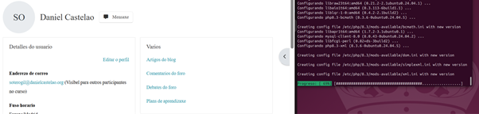
Comezamos a instalación actualizando e instalando todos os módulos e ferramentas que serán utilizados. Entre istos están o servizo Apache, PHP, MySQL etc.

Primeiro instalamos a pila LAMP, para iso actualizamos os repositorios e instalamos o software para que WordPress funcione.
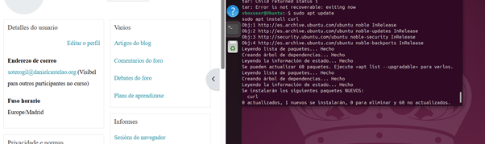
- `sudo apt update` actualiza a lista local de paquetes dispoñibles nos repositorios de Ubuntu.
- Tras isto, instálanse os paquetes para o servidor: Apache2 (o servidor) e PHP.
- Tamén se instala `php-mysql` para conectar PHP con MySQL.
- E se instala a ferramenta `curl`.

---

## 📂 Preparación dos ficheiros de WordPress
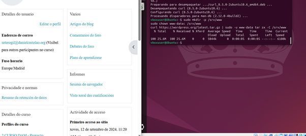
Agora comezamos a preparar os ficheiros para instalar WordPress.

- Creamos o directorio `/srv/www`.
- Logo cambiamos o propietario do directorio.
- Descargamos a versión máis recente de WordPress.

---

## 🌐 Configuración do servidor Apache
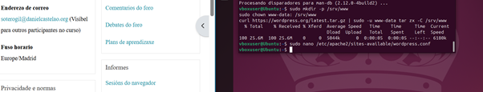
A partir de aquí, comezamos coa configuración do servidor Apache.

- Abrimos Nano para crear un ficheiro de configuración.
- Logo creamos un enlace que servirá de referencia no ficheiro.
- Habilitamos o módulo de Apache.
- Deshabilitamos o enlace para que non haxa conflitos.
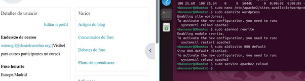
Aquí recargamos a configuración do servizo Apache.

---

## 🗄️ Creación da base de datos
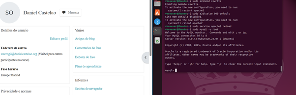
Aquí comecei coa creación da base de datos e un usuario dedicado para WordPress.
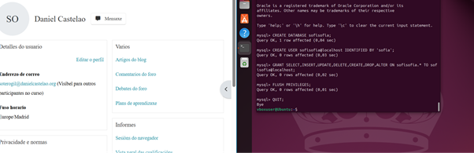
- Creamos a base de datos na que WordPress almacenará o seu contido.
- Creamos o usuario chamado `sofiasofia` e asignamos unha contrasinal.
- Otorgamos permisos ó usuario.
- Recargamos os permisos na memoria de MySQL.
- Por último, saímos do monitor de MySQL.

---

## 🔌 Conexión da base de datos a WordPress
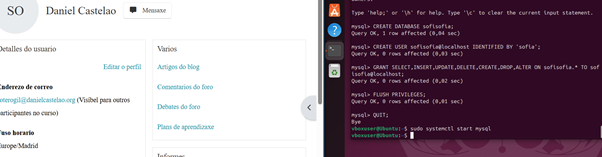
Aquí arrancamos de novo o servizo de MySQL para así conectar a base de datos a WordPress.
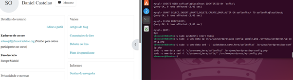
- Conectamos a base de datos ao WordPress.
- Utilizamos o comando `sed` para edición de texto e configuración de WordPress para indicar os nomes da base de datos, do usuario e o contrasinal.

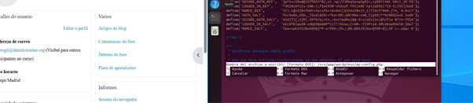
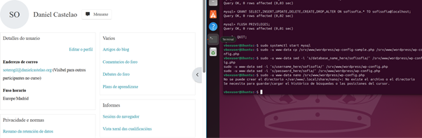

---

## 📝 Configuración final de WordPress
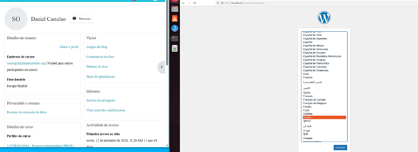
Finalmente, aquí configuramos a páxina de WordPress que xa está conectada.
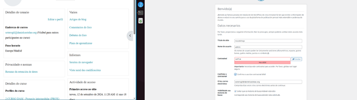

- Selecciono o nome da miña páxina web ademáis das miñas credenciais de acceso.
- É necesario tamén inserir un e-mail de contacto.
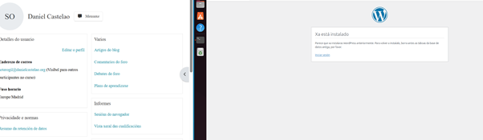
- Unha vez feito esto, o meu sitio web xa foi creado.
- Só teño que premer na URL azul para poder acceder dende a conta que creei.

---

## 🔐 Inicio de sesión
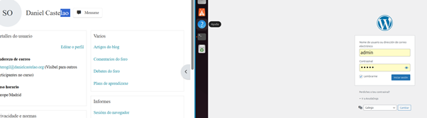
- Insirio os meus credenciais e clico en *Iniciar sesión*.
- Mostra de autoría da web con título e nome:
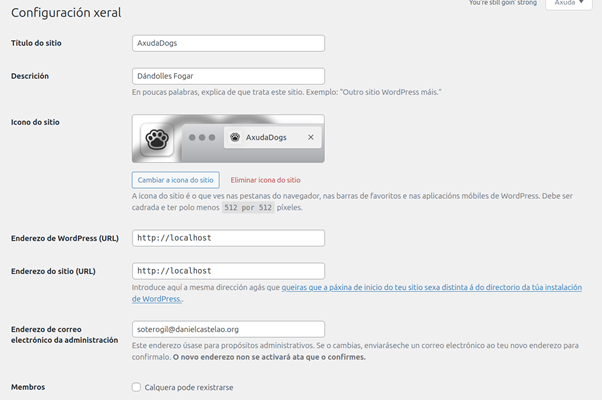

---

## 🎨 Personalización do tema

- A continuación, nas tres barras, selecciono o apartado **Apariencia** e engado o tema que máis me guste.
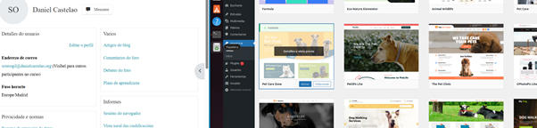
- O tema nun inicio é plano e debo ir creando diferentes elementos e entradas para personalizalo.

---

## 🔧 Plugins
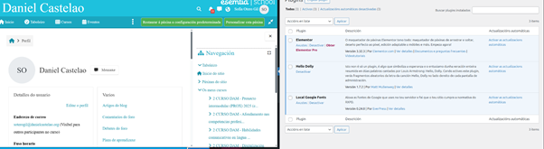

### 🧩 Elementor

O primeiro Pluggin do que fago uso é **Elementor**.  
Este, dende o seu apartado específico na barra de tarefas, permite acceder a un servizo de creación de web con IA.

- Toparémonos cun chat que nos fará preguntas sobre os contidos da web, ata chegar a un nivel de contidos suficiente.
- Unha vez terminado isto, chegaremos a unha páxina que nos permitirá instalar esta personalización na nosa web.
- Coma eu estou traballando dende o localhost, a única opción posible para instalar a personificación é descargándoa nun ZIP.

- Clicamos en *Importar* e engadimos o noso ZIP.
- Deste xeito, quedará subido ao noso WordPress sen maior esforzo.
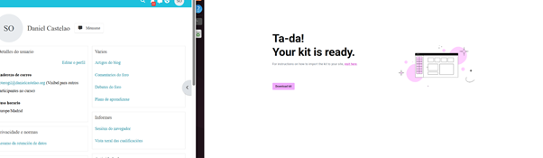
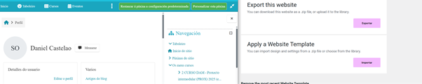
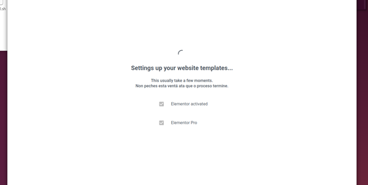
- O resto de personalización que fixen foron de correccións e adición de imaxes.

O resultado da web foi este:
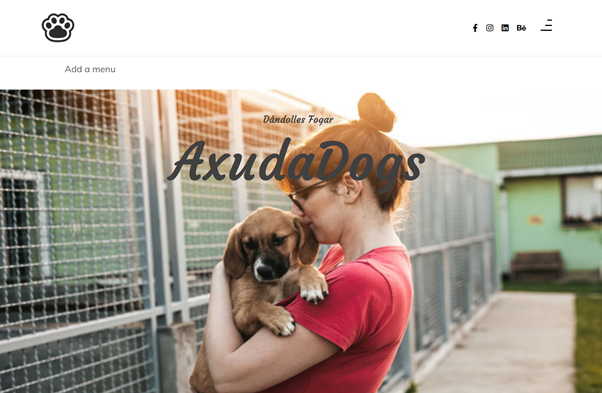
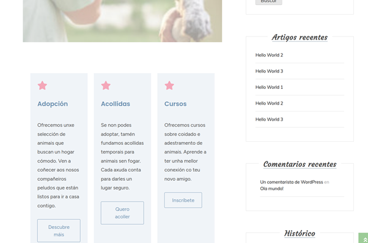

---

### 🧩 Outros Plugins:
- **Hello Dolly**  
  Este plugin engade frases aleatorias dunha canción no panel de administración de WordPress. Non ten unha función técnica, pero serve como decoración e recordatorio simpático.
    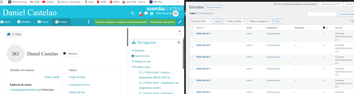
- **Google Local Fonts**  
  Este plugin permite usar fontes de Google Fonts almacenadas localmente no teu servidor, o que mellora a privacidade e velocidade do sitio web.
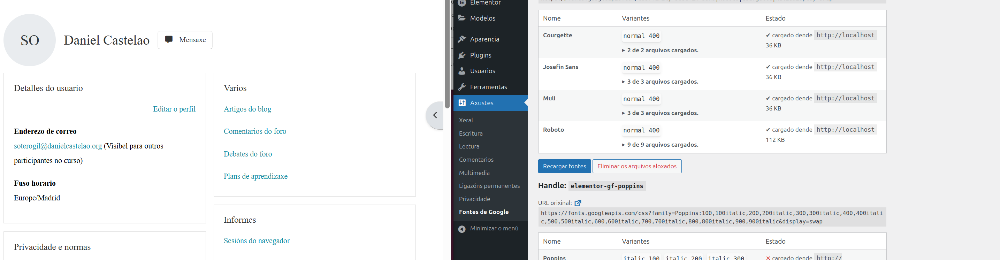
---
## 📚 Fontes Empregadas
- [Guía oficial de instalación de WordPress en Ubuntu](https://ubuntu.com/tutorials/install-and-configure-wordpress#1-overview)
