# Tarefa Docker Compose 
**Desenvolvido por**: Sofía Otero  
**Asignatura**: SXE

## Nivel 1 (obligatorio):
Crear un fichero docker-compose.yml que defina los siguientes servicios:
prestashop, db (MySQL o MariaDB) y phpMyAdmin.

● El fichero debe configurar las dependencias (depends_on) entre servicios y
las variables de entorno necesarias para la conexión.

● En este nivel, las contraseñas y otros datos de configuración pueden estar
escritos directamente en el fichero docker-compose.yml.

● El despliegue debe levantarse con un solo comando: docker-compose up.

● El README.md debe explicar la estructura del fichero y cómo utilizarlo.

● Incluir capturas de pantalla de los servicios funcionando. La captura de
pantalla de phpmyAdmin no vale que se vea que el servicio phpmyadmin
está corriendo, tienen que verse las tablas de la bbdd de prestashop.

Creo, lugar onde vou aloxar os meus arquivos. Máis adiante verase outro nome xa que tiven varios problemas a nivel de ariquivos e permisos dentro de Windows. É mellor idea usar unha VM de Linux.

Unha vez creados, neste caso abro un ficheiro de notas onde defino o meu .yml. Que conterá a información para, a miña base de datos MariaDB para gardar toda a información; que se instálase a tenda online PrestaShop que funciona usando esa base de datos; e que se engádese phpMyAdmin para administrar a base de datos de xeito dende o navegador.
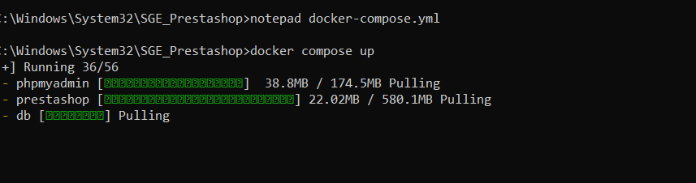

Xa co meu arquivo feito, que aclaro que non é final, lanzo docker-composer up, para definir e executar todas as accions e contedores Docker que creei.
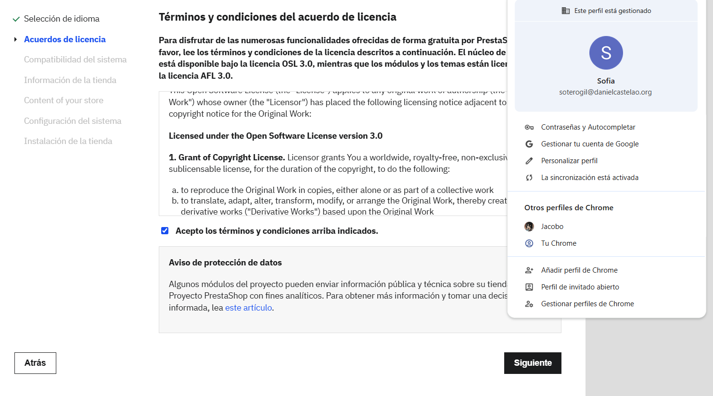

Logo disto, simplemete accedo ao local host de ambos servizos e introduzo as credenciais que asignei no meu .yml
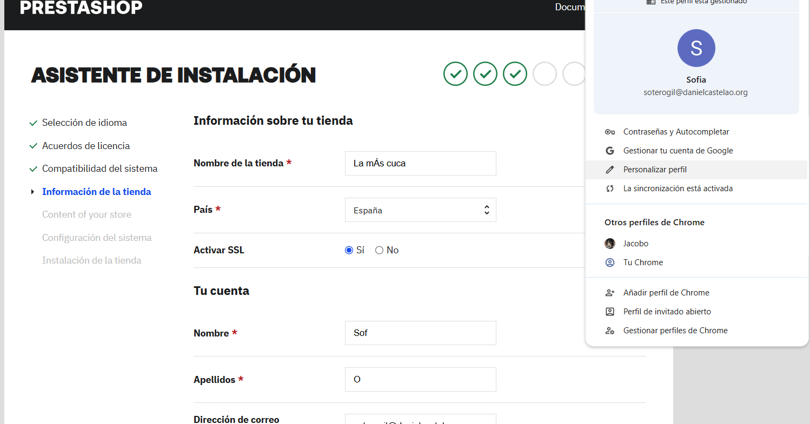

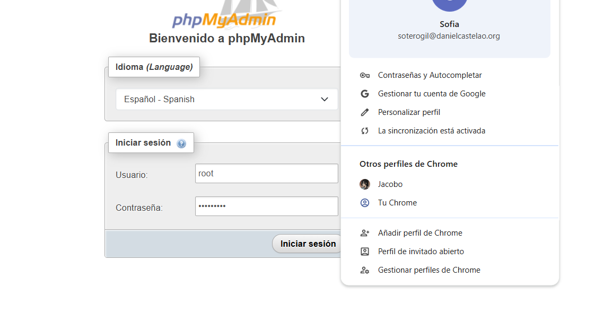
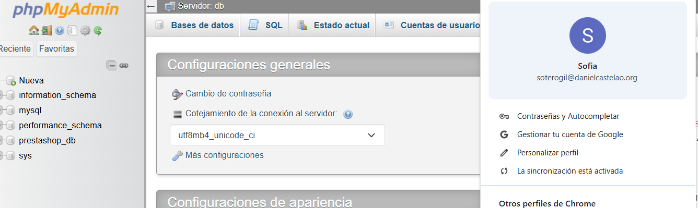
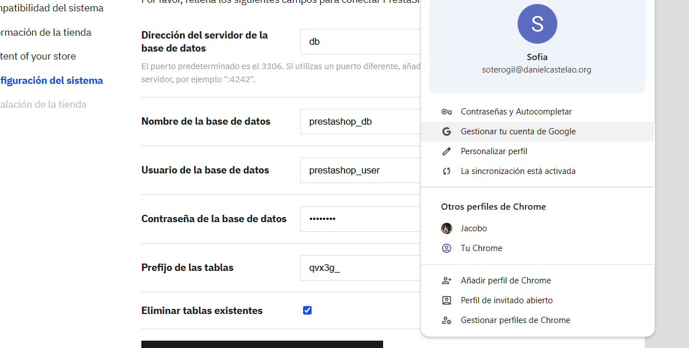
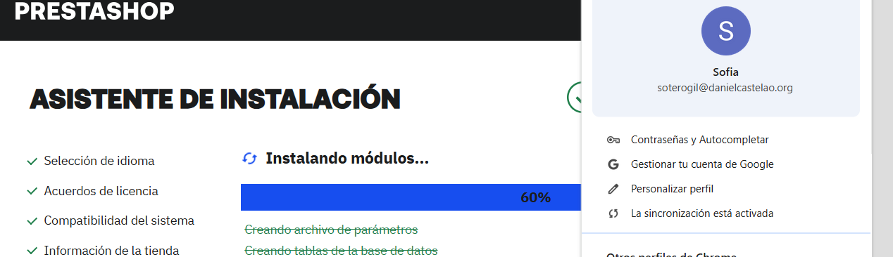
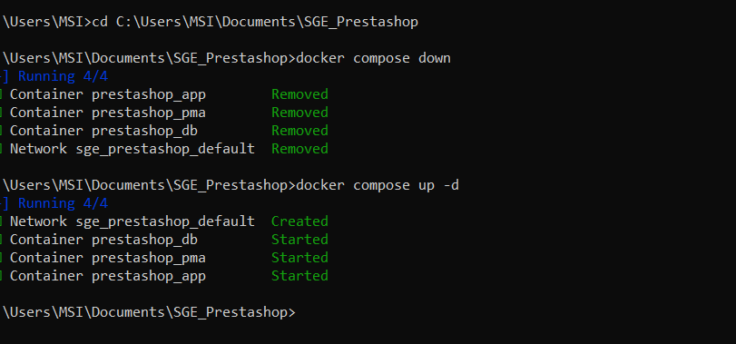
## Nivel 2 (opcional):
● Configuración Segura: Modificar el docker-compose.yml para que no
contenga ninguna contraseña o dato sensible. Toda esta información debe
cargarse desde un fichero .env externo.

Para crealo, neste caso empreguei o IDE non solo notepad, antes disto tivera problemas cos portos e Docker xa qeu tivera un erro e creara 2 proxectos, polo que tiña unha das miñas tarefas tratando de acceder a un porto xa ocupado. Para arreglalo tiven que facer kill a varios procesos e xestionar os PID con PowerShell, e dar moitísimos permisos, MOITOS. Seguindo con arquivo .env, tras crealo defino as credenciais e a configuración inicial da base de datos MariaDB e, ademais, establezo o correo e contrasinal do administrador.

● Persistencia de Datos: Utilizar volúmenes de Docker (volumes) para que
los datos de la base de datos (/var/lib/mysql) y los ficheros de
PrestaShop (/var/www/html) persistan aunque los contenedores se eliminen
y se vuelvan a crear.

Engadin o apartado de volumen , para que en caso de que se pechase  o contedor de MariaDB, non se perdesen os datos.

## Nivel 3 (opcional):

● Añadir una directiva healthcheck al servicio de la base de datos (db). Esta
comprobación debe verificar activamente que el servicio de base de datos
está operativo.

O healthcheck está aí para que a base de datos MariaDB comprobe o seu estado cada dez segundos usando un comando de ping e o contrasinal de root. Nin PrestaShop nin phpMyAdmin se lanzarán ata que esa comprobación confirme que a base de datos está en bo estado

● Modificar la directiva depends_on del servicio prestashop y phpMyAdmin
para que esperen a que el healthcheck sea correcto.

PrestaShop e phpMyAdmin teñen que esperar a que db este funcionando e  que o seu check de saúde diga que está operativa e lista para usarse.

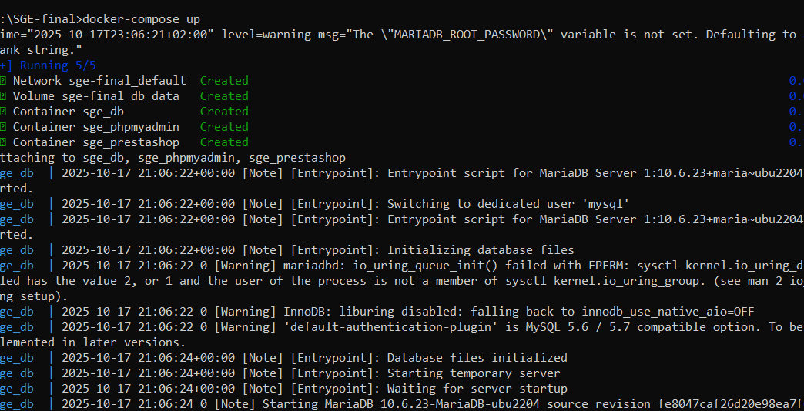
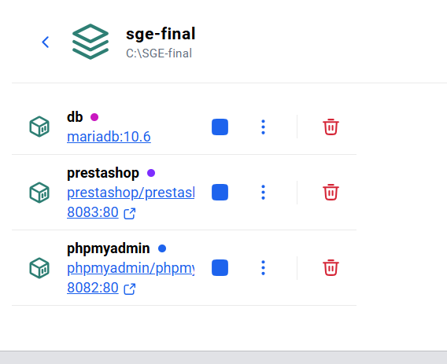

## Captura Resultado Final, inicio de sesión sin credenciais

 Hacer que la instalación de prestashop sea automática (es decir, que no
haya que utilizar el asistente de instalación) con el idioma español, país
España y login y password de usuario admin. Tened en cuenta que tardará
un poco más en estar accesible.

PhpMyAdmin non pide credenciais porque se lle pasan o nome do servidor (PMA_HOST: db) e o nome de usuario e contrasinal (PMA_USER e PMA_PASSWORD) directamente a través das variables de ambiente no Docker Compose.

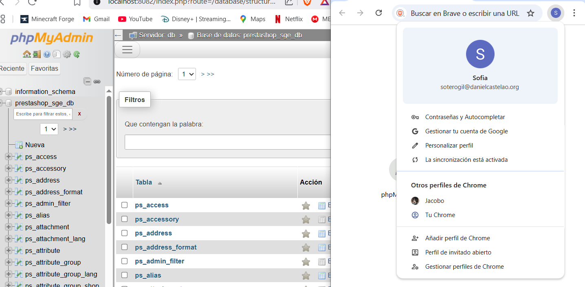

Neste punto foi cando me arrepentin totalmente de non empregar unha máquina virtual. Tiven un monton de problemas co FireWall de Windows, desactiveino para todo tipo de redes, pero seguiume dando problemas. Incluso probando por terminal. Finalmente, tras crear 3 copias do meu proxecto e intentar miles de cousas consegín que funcionase.

