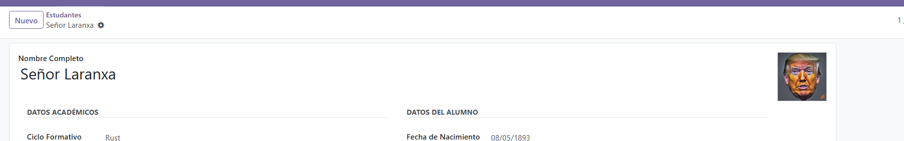
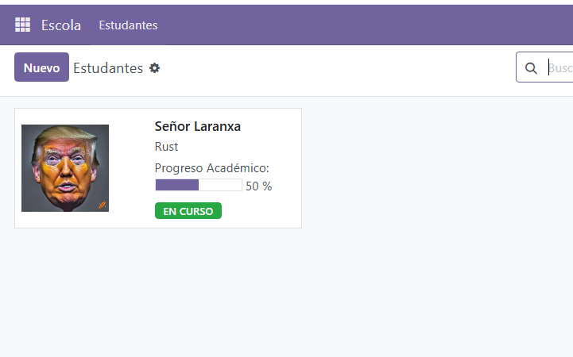
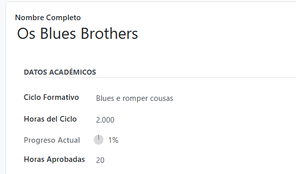
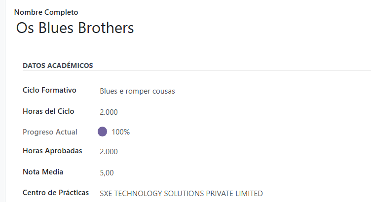
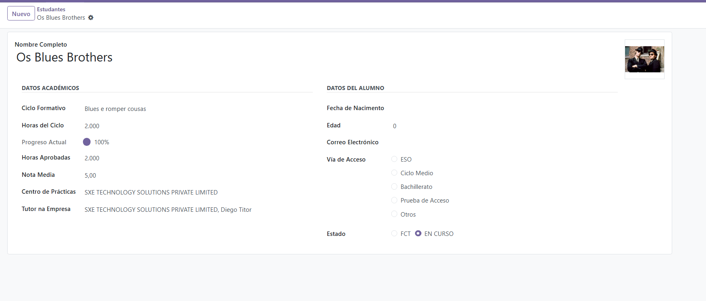
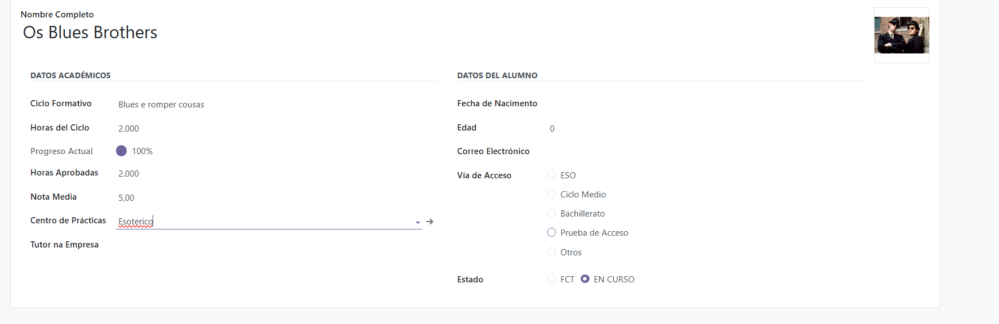
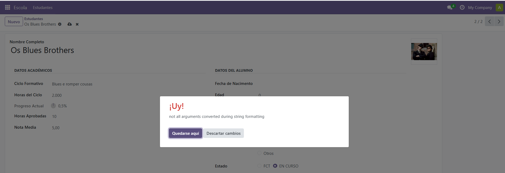

# TAREFA 19: Xestión de FCT en Odoo

Deseñei un sistema en Odoo que calcula o progreso académico dos alumnos e bloquea a asignación de empresas ata que superan o 50% das horas. Implementei unha regra de integridade que impide gardar a ficha se non se cumpre este requisito, asegurando que a xestión das FCT sexa rigorosa. Configurei a interface para que os campos de empresa e titor permanezan ocultos automaticamente, aparecendo só cando o alumno está realmente apto para as prácticas.

## NIVEL 1

## NIVEL 2

## NIVEL 3

## NIVEL 4

## NIVEL 5 
